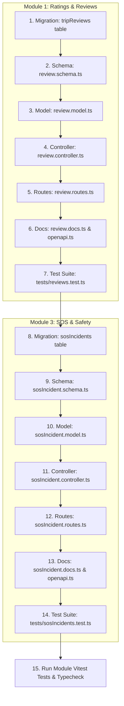

# Engineering Specification: Ratings & Reviews and SOS & Safety Modules

> **Version:** 1.0.0  
> **Status:** Draft / Planned  
> **Target System:** Nframa Backend API (`Express 5 + TypeScript + Knex + PostgreSQL + Zod`)

---

## Table of Contents
1. [Overview](#1-overview)
2. [Module 1: Ratings & Reviews (`tripReviews`)](#2-module-1-ratings--reviews-tripreviews)
   - [2.1 Context & Mobile App Alignment](#21-context--mobile-app-alignment)
   - [2.2 Database Schema & Migration](#22-database-schema--migration)
   - [2.3 Zod Validation Schemas](#23-zod-validation-schemas)
   - [2.4 Model Layer](#24-model-layer)
   - [2.5 Controller & Business Logic](#25-controller--business-logic)
   - [2.6 REST Routes & Authorization](#26-rest-routes--authorization)
   - [2.7 OpenAPI Docs & Examples](#27-openapi-docs--examples)
   - [2.8 Testing Strategy](#28-testing-strategy)
3. [Module 3: SOS & Safety Incident Management (`sosIncidents`)](#3-module-3-sos--safety-incident-management-sosincidents)
   - [3.1 Context & Mobile App Alignment](#31-context--mobile-app-alignment)
   - [3.2 Database Schema & Migration](#32-database-schema--migration)
   - [3.3 Zod Validation Schemas](#33-zod-validation-schemas)
   - [3.4 Model Layer](#34-model-layer)
   - [3.5 Controller & Business Logic](#35-controller--business-logic)
   - [3.6 REST Routes & Authorization](#36-rest-routes--authorization)
   - [3.7 OpenAPI Docs & Examples](#37-openapi-docs--examples)
   - [3.8 Testing Strategy](#38-testing-strategy)
4. [Step-by-Step Implementation Roadmap](#4-step-by-step-implementation-roadmap)

---

## 1. Overview

This document specifies the database schemas, API contracts, domain validation rules, authorization logic, and test suites for two core backend features:
- **Module 1 (Ratings & Reviews)**: Enables bidirectional post-trip reviews, comments, compliments, driver tips, and aggregate rating calculation for drivers and riders.
- **Module 3 (SOS & Safety Incident Management)**: Implements panic triggers, emergency contact integration, real-time GPS tracking of safety events, and operational incident dispatch lifecycles.

Both modules adhere to Nframa backend conventions:
- Strict TypeScript ESM with explicit `.js` import extensions.
- Knex query builder extending `BaseModel`.
- Controller input parsing through `req.validated`.
- Response envelopes: `{ success: true, message, data }` or `{ success: false, error }`.
- Activity logging via `logActivity` for auditability.
- Automated tests using Vitest with isolated actor factories and lifecycle cleanup hooks.

---

## 2. Module 1: Ratings & Reviews (`tripReviews`)

### 2.1 Context & Mobile App Alignment
- **Rider App (`customer`)**:
  - `RateDriverModal.tsx`: Opens automatically upon trip completion.
  - Inputs: Star rating (1–5), optional comment, optional tip (`tip`: GHS 0, 5, 10, 20, 50), and compliments/tags (e.g., *"Clean Vehicle"*, *"Punctual"*, *"Polite"*).
  - Displays driver rating on search cards and upcoming trip sheets.
- **Driver App (`driver`)**:
  - `app/profile/reviews.tsx`: Displays list of passenger reviews, individual star scores, pickup/dropoff corridors, and average performance rating.
  - `components/home/MetricsGrid.tsx`: Real-time rating widget.

---

### 2.2 Database Schema & Migration
File: `src/database/migrations/20261002235000_create_trip_reviews_table.ts`

```sql
CREATE TABLE "tripReviews" (
  "id" uuid PRIMARY KEY DEFAULT gen_random_uuid(),
  "tripId" uuid NOT NULL REFERENCES "trips"("id") ON DELETE CASCADE,
  "reviewerUserId" uuid NOT NULL REFERENCES "users"("id") ON DELETE CASCADE,
  "revieweeUserId" uuid NOT NULL REFERENCES "users"("id") ON DELETE CASCADE,
  "reviewerRole" text NOT NULL CHECK ("reviewerRole" IN ('rider', 'driver')),
  "rating" smallint NOT NULL CHECK ("rating" >= 1 AND "rating" <= 5),
  "comment" text,
  "tags" text[],                      -- Array of compliment tags e.g. ["Punctual", "Clean Vehicle"]
  "tip" numeric(10,2) NOT NULL DEFAULT 0.00,
  "createdAt" timestamptz NOT NULL DEFAULT now(),
  "updatedAt" timestamptz NOT NULL DEFAULT now(),

  -- Constraint: Exactly one review per reviewer per trip
  CONSTRAINT "uq_tripReviews_tripId_reviewerUserId" UNIQUE ("tripId", "reviewerUserId")
);

-- Indices for performance
CREATE INDEX "idx_tripReviews_revieweeUserId" ON "tripReviews" ("revieweeUserId");
CREATE INDEX "idx_tripReviews_tripId" ON "tripReviews" ("tripId");
```

---

### 2.3 Zod Validation Schemas
File: `src/schemas/review.schema.ts`

```ts
import { z } from "zod";

export const reviewRatingSchema = z
  .coerce.number()
  .int()
  .min(1)
  .max(5)
  .meta({ description: "Star rating from 1 to 5", example: 5 });

export const reviewCommentSchema = z
  .string()
  .trim()
  .max(1000)
  .optional()
  .meta({ description: "Feedback commentary", example: "Great driver! Very punctual and clean car." });

export const reviewTagsSchema = z
  .array(z.string().trim().max(50))
  .max(10)
  .optional()
  .meta({ example: ["Punctual", "Clean Vehicle", "Smooth Driving"] });

export const reviewTipSchema = z
  .coerce.number()
  .nonnegative()
  .optional()
  .default(0)
  .meta({ description: "Optional driver tip in GHS", example: 10.0 });

export const createTripReviewSchema = z.object({
  rating: reviewRatingSchema,
  comment: reviewCommentSchema,
  tags: reviewTagsSchema,
  tip: reviewTipSchema,
});

export type CreateTripReviewInput = z.infer<typeof createTripReviewSchema>;

export const updateTripReviewSchema = z
  .object({
    rating: reviewRatingSchema.optional(),
    comment: reviewCommentSchema,
    tags: reviewTagsSchema,
  })
  .refine((data) => Object.keys(data).length > 0, {
    message: "At least one field must be provided to update",
  });

export type UpdateTripReviewInput = z.infer<typeof updateTripReviewSchema>;

export const listUserReviewsQuerySchema = z.object({
  page: z.coerce.number().int().min(1).default(1),
  limit: z.coerce.number().int().min(1).max(50).default(20),
});

export const tripReviewResponseSchema = z.object({
  id: z.uuid(),
  tripId: z.uuid(),
  reviewerUserId: z.uuid(),
  revieweeUserId: z.uuid(),
  reviewerRole: z.enum(["rider", "driver"]),
  rating: z.number().int(),
  comment: z.string().nullable(),
  tags: z.array(z.string()).nullable(),
  tip: z.number(),
  createdAt: z.iso.datetime(),
  updatedAt: z.iso.datetime(),
  reviewerName: z.string().optional(),
  reviewerAvatar: z.string().nullable().optional(),
});

export const ratingSummaryResponseSchema = z.object({
  userId: z.uuid(),
  averageRating: z.number().meta({ example: 4.88 }),
  totalReviews: z.number().int().meta({ example: 42 }),
  breakdown: z.object({
    star1: z.number().int(),
    star2: z.number().int(),
    star3: z.number().int(),
    star4: z.number().int(),
    star5: z.number().int(),
  }),
});
```

---

### 2.4 Model Layer
File: `src/models/review.model.ts`

- Extends `BaseModel<TripReview>`.
- Methods:
  - `createReview(data)`: Persists review row.
  - `findByTripAndReviewer(tripId, reviewerUserId)`: Checks for duplicate review attempts.
  - `listByReviewee(revieweeUserId, { page, limit })`: Paginated reviews with reviewer profile details (name, avatar) joined.
  - `getRatingSummary(revieweeUserId)`: Aggregates `AVG(rating)` and counts per star score.

---

### 2.5 Controller & Business Logic
File: `src/controllers/review.controller.ts`

1. **`createTripReview`**:
   - Verifies trip exists and has status `completed`.
   - Checks caller was a participant (`riderId` or `driverId` on the trip/commute).
   - Resolves target `revieweeUserId` (rider rates driver; driver rates rider).
   - If `tip > 0` and reviewer is rider: initiates wallet transfer from rider to driver wallet.
   - Saves review and logs activity (`module: "trips"`, `action: "review.create"`).
2. **`getTripReviews`**:
   - Returns review(s) associated with `tripId`.
3. **`updateTripReview`**:
   - Ensures caller is `reviewerUserId`. Updates rating or commentary.
4. **`getUserReviews` & `getUserRatingSummary`**:
   - Returns reviews received by the specified user and aggregate stats.
5. **`deleteTripReview`**:
   - Admin-only moderation (`users: delete`).

---

### 2.6 REST Routes & Authorization
File: `src/routes/review.routes.ts`

```ts
POST   /trips/:tripId/reviews        -> authenticate, validate(body), createTripReview
GET    /trips/:tripId/reviews        -> authenticate, getTripReviews
PATCH  /reviews/:id                  -> authenticate, validate(body), updateTripReview
GET    /users/:userId/reviews        -> authenticate, validate(query), getUserReviews
GET    /users/:userId/ratings/summary -> authenticate, getUserRatingSummary
DELETE /reviews/:id                  -> authenticate, requirePermission("users", "delete"), deleteTripReview
```

---

### 2.7 OpenAPI Docs & Examples
File: `src/docs/review.docs.ts`
- Registered in `src/docs/openapi.ts` in alphabetical order.
- Tags: `["Reviews"]`.
- Documented 200, 201, 400, 401, 403, 404, and 409 responses with realistic examples.

---

### 2.8 Testing Strategy
File: `tests/reviews.test.ts`
- Tests completed trip requirement (rejects rating on `pending` / `active` trips).
- Tests duplicate prevention (409 on second review for same trip by same caller).
- Tests non-participant rejection (403 if caller was not rider/driver on trip).
- Tests rating summary calculation accuracy across multiple ratings.
- Tests reviewer update and admin deletion.

---

---

## 3. Module 3: SOS & Safety Incident Management (`sosIncidents`)

### 3.1 Context & Mobile App Alignment
- **Rider & Driver SOS Trigger**:
  - `app/sos/hold.tsx`: Press and hold button for 3 seconds to trigger panic.
  - `app/sos/confirm.tsx`: Confirmation / immediate dispatch cancellation within 10-second grace window.
  - `app/sos/status.tsx`: Live timeline tracking incident stages:
    - `triggered` / `underReview` ("Our Operations Team is reviewing your emergency")
    - `servicesContacted` ("Ghana Emergency Services 112 / Police contacted")
    - `resolved` ("Incident Resolved")
- **Emergency Contacts**:
  - Automatically queries the `emergencyContacts` table to capture phone numbers and relationships at incident trigger time.

---

### 3.2 Database Schema & Migration
File: `src/database/migrations/20261002235500_create_sos_incidents_table.ts`

```sql
CREATE TABLE "sosIncidents" (
  "id" uuid PRIMARY KEY DEFAULT gen_random_uuid(),
  "userId" uuid NOT NULL REFERENCES "users"("id") ON DELETE CASCADE,
  "tripId" uuid REFERENCES "trips"("id") ON DELETE SET NULL,
  "role" text NOT NULL CHECK ("role" IN ('rider', 'driver')),
  "status" text NOT NULL DEFAULT 'triggered' 
    CHECK ("status" IN ('triggered', 'underReview', 'servicesContacted', 'resolved', 'cancelledByUser')),
  "latitude" numeric(9,6) NOT NULL,
  "longitude" numeric(9,6) NOT NULL,
  "address" text,
  "reason" text,                      -- e.g. "Personal/Medical Emergency", "Vehicle Collision", "Physical Danger"
  "emergencyContactsSnapshot" jsonb,  -- Snapshot: [{ id, name, phoneCountryCode, phoneNumber, relationship }]
  "resolvedByAdminId" uuid REFERENCES "adminUsers"("id") ON DELETE SET NULL,
  "resolutionNotes" text,
  "resolvedAt" timestamptz,
  "createdAt" timestamptz NOT NULL DEFAULT now(),
  "updatedAt" timestamptz NOT NULL DEFAULT now()
);

-- Indices
CREATE INDEX "idx_sosIncidents_userId" ON "sosIncidents" ("userId");
CREATE INDEX "idx_sosIncidents_tripId" ON "sosIncidents" ("tripId");
CREATE INDEX "idx_sosIncidents_status" ON "sosIncidents" ("status");
CREATE INDEX "idx_sosIncidents_createdAt" ON "sosIncidents" ("createdAt" DESC);
```

---

### 3.3 Zod Validation Schemas
File: `src/schemas/sosIncident.schema.ts`

```ts
import { z } from "zod";

export const triggerSosSchema = z.object({
  tripId: z.uuid().optional().meta({ description: "Trip in progress when SOS was pressed" }),
  latitude: z.coerce.number().min(-90).max(90).meta({ example: 5.6037 }),
  longitude: z.coerce.number().min(-180).max(180).meta({ example: -0.187 }),
  address: z.string().trim().max(255).optional().meta({ example: "Liberation Rd, near Accra Mall" }),
  reason: z
    .enum(["Personal/Medical Emergency", "Vehicle Collision", "Physical Danger", "Other"])
    .optional()
    .default("Other")
    .meta({ example: "Personal/Medical Emergency" }),
});

export type TriggerSosInput = z.infer<typeof triggerSosSchema>;

export const cancelSosSchema = z.object({
  cancellationReason: z.string().trim().max(255).optional().meta({ example: "False alarm - pressed by accident" }),
});

export const updateSosStatusSchema = z.object({
  status: z.enum(["underReview", "servicesContacted", "resolved"]),
  resolutionNotes: z.string().trim().min(1).max(2000).optional().meta({
    example: "Police dispatched to mile 4; passenger safely transferred to alternate shuttle.",
  }),
});

export const listSosIncidentsQuerySchema = z.object({
  status: z.enum(["triggered", "underReview", "servicesContacted", "resolved", "cancelledByUser"]).optional(),
  page: z.coerce.number().int().min(1).default(1),
  limit: z.coerce.number().int().min(1).max(100).default(20),
});

export const sosIncidentResponseSchema = z.object({
  id: z.uuid(),
  userId: z.uuid(),
  tripId: z.uuid().nullable(),
  role: z.enum(["rider", "driver"]),
  status: z.enum(["triggered", "underReview", "servicesContacted", "resolved", "cancelledByUser"]),
  latitude: z.number(),
  longitude: z.number(),
  address: z.string().nullable(),
  reason: z.string().nullable(),
  emergencyContactsSnapshot: z.array(z.record(z.string(), z.unknown())).nullable(),
  resolvedByAdminId: z.uuid().nullable(),
  resolutionNotes: z.string().nullable(),
  resolvedAt: z.iso.datetime().nullable(),
  createdAt: z.iso.datetime(),
  updatedAt: z.iso.datetime(),
  userFullName: z.string().optional(),
  userPhone: z.string().optional(),
});
```

---

### 3.4 Model Layer
File: `src/models/sosIncident.model.ts`

- Extends `BaseModel<SosIncident>`.
- Methods:
  - `triggerIncident(input, user, emergencyContacts)`: Creates incident with pre-populated JSON snapshot of user's active emergency contacts.
  - `findActiveByUser(userId)`: Returns latest un-resolved incident (`status IN ('triggered', 'underReview', 'servicesContacted')`).
  - `cancelByUser(id, notes)`: Updates status to `cancelledByUser`.
  - `updateStatusByAdmin(id, adminId, status, resolutionNotes)`: Updates state and sets `resolvedAt` if status is `resolved`.
  - `listIncidents(filters, pagination)`: Admin view joining user phone & name.

---

### 3.5 Controller & Business Logic
File: `src/controllers/sosIncident.controller.ts`

1. **`triggerSos`**:
   - Identifies caller identity & role (`rider` or `driver`).
   - Fetches caller's emergency contacts via `emergencyContactModel.listForUser(callerId)`.
   - Records SOS incident.
   - Logs critical safety audit log (`action: "sos.trigger"`).
   - Emits real-time event via Socket.IO room `admin:safety` for immediate operations alerting.
2. **`getActiveSos`**:
   - Returns caller's currently active emergency event so the mobile app can restore `/sos/status` state after restart.
3. **`cancelSos`**:
   - Allows caller to cancel within grace window / mark false alarm.
4. **`adminListIncidents` & `adminGetIncident`**:
   - Admin operations queue for safety dispatchers (`users: read`).
5. **`adminUpdateIncidentStatus`**:
   - Transitions state to `underReview`, `servicesContacted`, or `resolved`.

---

### 3.6 REST Routes & Authorization
File: `src/routes/sosIncident.routes.ts`

```ts
// User routes (Riders and Drivers)
POST   /safety/sos              -> authenticate, validate(body), triggerSos
GET    /safety/sos/active       -> authenticate, getActiveSos
PATCH  /safety/sos/:id/cancel   -> authenticate, validate(body), cancelSos

// Admin / Dispatch routes
GET    /admin/safety/incidents      -> authenticate, requirePermission("users", "read"), adminListIncidents
GET    /admin/safety/incidents/:id  -> authenticate, requirePermission("users", "read"), adminGetIncident
PATCH  /admin/safety/incidents/:id  -> authenticate, requirePermission("users", "update"), adminUpdateIncidentStatus
```

---

### 3.7 OpenAPI Docs & Examples
File: `src/docs/sosIncident.docs.ts`
- Registered in `src/docs/openapi.ts`.
- Tags: `["Safety & SOS"]`.
- Includes request coordinates, contact snapshots, and status transition workflows.

---

### 3.8 Testing Strategy
File: `tests/sosIncidents.test.ts`
- Tests triggering SOS by rider and driver with valid GPS coordinates.
- Tests automatic snapshotting of user's emergency contacts.
- Tests user self-cancellation (`cancelledByUser`).
- Tests permission controls (riders cannot read other riders' SOS alerts or update admin resolution status).
- Tests admin status workflow (`triggered` ➔ `underReview` ➔ `servicesContacted` ➔ `resolved`).
- Tests active SOS detection when opening app.

---

## 4. Step-by-Step Implementation Roadmap



### Execution Rules (from `CLAUDE.md`)
- Migrations: Create clean, non-conflicting migrations with unique timestamps; never edit previously run migrations.
- Tests: Run tests exclusively for the module being modified (`pnpm test reviews`, `pnpm test sosIncidents`).
- Docs: Ensure OpenAPI documentation tags and schemas precisely match controller responses.
- Cleanup: Register both `tripReviews` and `sosIncidents` in `DELETE_ORDER` in `tests/helpers/cleanup.ts`.
